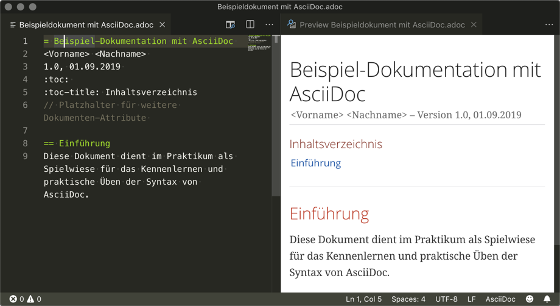

= Beispiel-Dokumentation mit AsciiDoc 
Tom Jandke s77831@htw-dresden.de
1.0, 21.10.2019 
:toc: 
:toc-title: Inhaltsverzeichnis
:source-highlighter: highlightjs
:xrefstyle: full
// Platzhalter für weitere Dokumenten-Attribute 

== Einführung
Dieses Dokument dient im Praktikum als Spielwiese für das Kennenlernen und praktische Üben der Syntax von AsciiDoc.

== Kennenlernen der Syntax

Über die Aufgaben wird das Dokument Stück für Stück aufgebaut und angepasst.

=== Listen

.Beispiel: unsortierte Liste 
* Edgar Allen Poe
* Sheri S. Tepper
* Bill Bryson

.Beispiel: sortierte Liste
. level 1
.. level 2
... level 3
.... level 4
..... level 5
. level 1

=== Tabellen und Textformatierung
.Table Title
|===
|Formatierung|Syntax |Beschreibung 

|bold
|*bold*
|fetter Text

|italic
|_italic_
|kursiv

|monospace
|`monospace`
|Text mit fester Laufweite

|bold&italic
|*_bold&italic_*
|Text mit kombinierter Formatierung

|bold&italic
|**bold**&__italic__
|Text mit Formatierung innerhalb eines Wortes
|===
**S**__o__ftw__a__r__e__ __E__ng__i__n__ee__``r__i__ng``

=== Quellcode

[source, c]
----
hello_world.c

#include <stdio.h>

int main(int argc, char* argv[])
{
    printf("Hello, World\n");
    return 0;
}
----

=== Bilder

.Screenshot VSCode mit AsciiDoc
[#b1]

=== Verweise

See <<Kennenlernen der Syntax>> to learn how to write paragraphs.

Learn how to organize the document into <<Tabellen und Textformatierung>>.

See <<Quellcode,hello_world.c>> to learn how to write paragraphs.

Learn how to organize the document into <<b1>>.